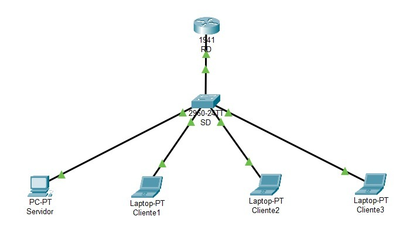

# Proyecto Integrador 4° Semestre Grupo B

## **Datos del Equipo**  
**Institución**: Instituto Tecnológico Superior del Occidente del Estado de Hidalgo.  
**Programa Educativo**: Ingeniería en Tecnologías de la Información y Comunicaciones.  
**Semestre y Grupo**: 4° "B".  
**Asignatura**: Fundamentos de Redes.  

**Integrantes**:    
- Abraham Calva (230110637)  
- Freyra Wendy Martinez Martinez (230110434)  
- Carol Mera Ibarra (230110264)
- Valeria Soto Hernandez (230110118)   
---

## **Resumen ejecutivo**
El proyecto integrador tuvo como objetivo desarrollar un sistema de gestión de pedidos para una florería, modernizando sus procesos operativos y mejorando la atención al cliente. La florería enfrentaba problemas de desorganización y errores por la administración manual de pedidos. Se diseñó un sistema automatizado para gestionar clientes, productos, pedidos, pagos y entregas, utilizando Visual Studio 2022, C#, el patrón MVC y SQL Server. La metodología Scrum facilitó una planificación ágil y validaciones continuas por parte del cliente.
El sistema, implementado en una arquitectura cliente-servidor, incluye módulos específicos para la gestión integral de la operación diaria. Como resultado, se optimizaron los procesos, redujeron los errores humanos y se mejoró la disponibilidad de información. El proyecto representa un avance significativo hacia la transformación digital de la florería, aportando valor operativo y estratégico.
---

## **Introducción**
Este proyecto integrador tuvo como objetivo el desarrollo de un sistema informático para la gestión de pedidos en una florería, con el fin de automatizar procesos que antes se realizaban manualmente y que generaban errores, retrasos y desorganización.
El impacto de este proyecto es en distintos ámbitos: en la sociedad, mejora el servicio al cliente; en el comercio, apoya la digitalización de pequeños negocios; en la política, se alinea con iniciativas de transformación digital; en la industria, moderniza sectores tradicionales; y en la educación, aplica conocimientos técnicos en un caso real.

---
## **Problematica:**

La gestión de pedidos en la florería se realiza de manera manual o con métodos poco organizados, lo que genera dificultades en el control de los pedidos, retrasos en las entregas y posibles errores en la administración de clientes, productos y pagos. Esto impacta negativamente en la eficiencia operativa del negocio y en la satisfacción del cliente, ya que no se cuenta con un sistema que permita organizar y automatizar los procesos de forma eficiente.
---
## **Objetivo General**

Desarrollar un sistema informático que permita la gestión eficiente de la agenda de pedidos de una florería, clientes, productos y envíos a domicilio,  mediante una bases de datos, un lenguaje de programación; implementado en una red de comuputadora cliente servidor.

---
## **Requerimientos de la organización con respecto a la red**
<table>
  <thead>
    <tr>
      <th>Número</th>
      <th>Categoría</th>
      <th>Detalles</th>
    </tr>
  </thead>
  <tbody>
    <tr>
      <td>1</td>
      <td>Cantidad de usuarios</td>
      <td>Máximo estimado de usuarios simultáneos: 3 a 5 usuarios (clientes internos). Tipo de usuario: Personal administrativo, encargado de ventas, encargado de entregas. La red debe permitir conexiones simultáneas al servidor sin afectar el rendimiento.</td>
    </tr>
    <tr>
      <td>2</td>
      <td>Topología de red</td>
      <td>Tipo de topología: Estrella. Todos los dispositivos (clientes y servidor) deben conectarse a través de un switch central para garantizar una comunicación eficiente.</td>
    </tr>
    <tr>
      <td>3</td>
      <td>Ancho de banda</td>
      <td>Recomendado: mínimo 100 Mbps en red local (LAN). Ideal: 1 Gbps si se desea garantizar fluidez y escalabilidad futura. Dado que el sistema opera en red local con transmisión de datos ligeros (texto e imágenes simples), no requiere grandes anchos de banda.</td>
    </tr>
    <tr>
      <td>4</td>
      <td>Seguridad de red</td>
      <td>Implementar un cortafuegos (firewall) que controle el acceso a los puertos utilizados por la aplicación y la base de datos. Control de acceso mediante credenciales por usuario en el sistema. Segmentación de red local (VLANs) opcional si se desea separar funciones administrativas y operativas. Se recomienda realizar respaldos periódicos de la base de datos y guardarlos en un equipo o ubicación segura.</td>
    </tr>
    <tr>
      <td>5</td>
      <td>Dirección IP y conectividad</td>
      <td>El servidor debe tener una IP fija en la red local para asegurar la conexión estable desde los equipos cliente. Los clientes deben tener acceso a esa IP mediante conexión directa por cable o Wi-Fi confiable.</td>
    </tr>
  </tbody>
</table>

---
## **Alcance Técnico de la Topología**  
1. **Asignación de Direcciones IP:**

- Se utilizará un bloque IPv4 privado clase C (172.16.0.0/24), dividido en subredes para organizar de forma eficiente el direccionamiento.

2. **Soporte para IPv6:**

- Se integrará direccionamiento Global Unicast (2001:db8::/64) junto con Link-Local automático, permitiendo conectividad moderna y facilitando la futura migración completa a IPv6.

3. **Parámetros de Configuración:**

- Router: Se habilitará el enrutamiento IPv6, se establecerán contraseñas cifradas tipo Secret y se activará el acceso remoto vía SSH.

- Switch: Se configurará la interfaz VLAN1 con dirección IPv4, gateway predeterminado y una descripción administrativa.

---
## **Cálculo de  Subred en Equipo 4**  
**Dirección IP:** 172.16.0.0 /24  
**Máscara:** 255.255.255.0  
**Número de Subredes:** 8    
**Nueva máscara:** 255.255.255.224  =  /27   

<table>
    <tr>
        <td> <strong>172.16.0.</strong> </td>
        <td> <strong>128</strong> </td>
        <td> <strong>64</strong> </td>
        <td> <strong>32</strong> </td>
        <td> <strong>16</strong> </td>
        <td> <strong>8</strong> </td>
        <td> <strong>4</strong> </td>
        <td> <strong>2</strong> </td>
        <td> <strong>1</strong> </td>
        <td> 
            <strong>Network ID</strong>
            

            <strong>Broadcast</strong>
            </td>
            <td><strong>1er Dirección</strong>
            

            <strong>Ult. Dirección</strong>
        </td>
    </tr>
    <tr>
        <td rowspan="2" > <strong>Equipo 1</strong> </td>
        <td>0 </td>
        <td>0 </td>
        <td>0 </td>
        <td> </td>
        <td> </td>
        <td> </td>
        <td> </td>
        <td> </td>
        <td> </td>
        <td> </td>
    </tr>
    <tr>
        <td> 0 </td>
        <td> 0 </td>
        <td> 0 </td>
        <td> </td>
        <td> </td>
        <td> </td>
        <td> </td>
        <td> </td>
        <td> </td>
        <td> </td>
    </tr>
    <tr>
        <td rowspan="2" ><strong>Equipo 2</strong></td>
        <td>0</td>
        <td>0</td>
        <td>1</td>
        <td></td>
        <td></td>
        <td></td>
        <td></td>
        <td></td>
        <td></td>
        <td></td>
    </tr>
    <tr>
        <td>0</td>
        <td>0</td>
        <td>1</td>
        <td></td>
        <td></td>
        <td></td>
        <td></td>
        <td></td>
        <td></td>
        <td></td>
    </tr>
    <tr>
        <td rowspan="2" ><strong>Equipo 3</strong></td>
        <td>0</td>
        <td>1</td>
        <td>0</td>
        <td></td>
        <td></td>
        <td></td>
        <td></td>
        <td></td>
        <td></td>
        <td></td>
    </tr>
    <tr>
        <td>0</td>
        <td>1</td>
        <td>0</td>
        <td></td>
        <td></td>
        <td></td>
        <td></td>
        <td></td>
        <td></td>
        <td></td>
    </tr>
    <tr>
        <td rowspan="2" ><strong>Equipo 4</strong></td>
        <td>0</td>
        <td>1</td>
        <td>1</td>
        <td>0</td>
        <td>0</td>
        <td>0</td>
        <td>0</td>
        <td>0</td>
        <td>172.16.0.96</td>
        <td>172.16.0.97</td>
    </tr>
    <tr>
        <td>0</td>
        <td>1</td>
        <td>1</td>
        <td>1</td>
        <td>1</td>
        <td>1</td>
        <td>1</td>
        <td>1</td>
        <td>172.16.0.127</td>
        <td>172.16.0.126</td>
    </tr>
</table>

--- 

## **Direccionamiento de nuestra subred**
<table>
    <tr>
        <td colspan="5" ><strong>Switch SD</strong> </td>
    </tr>
    <tr>
        <td> <strong>Interface</strong> </td>
        <td> <strong>IPv4</strong> </td>
        <td> <strong>Máscara</strong> </td>
        <td> <strong>IPv6 Link-Local</strong> </td>
        <td> <strong>IPv6 Global (eui-64)</strong> </td>
    </tr>
    <tr>
        <td> VLAN 1 </td>
        <td> 172.16.0.97 </td>
        <td> 255.255.255.224 </td>
        <td> FE80::1 </td>
        <td> 2001:db8:1:d::/64</td>
    </tr>
</table>
<table>
    <tr>
        <td colspan="5" > <strong>Router RD</strong> </td>
    </tr>
    <tr>
        <td> <strong>Interface</strong> </td>
        <td> <strong>IPv4</strong> </td>
        <td> <strong>Máscara</strong> </td>
        <td> <strong>IPv6 Link-Local</strong> </td>
        <td> <strong>IPv6 Global (eui-64)</strong> </td>
    </tr>
    <tr>
        <td> GigabitEthernet 0/1 </td>
        <td> 172.16.0.98 </td>
        <td> 255.255.255.224 </td>
        <td> FE80::1 </td>
        <td> 2001:db8:1:d::/64 </td>
    </tr>
</table>

--- 

## **Topología**
    
La topología utilizada en este proyecto es la que se muestra en pantalla y que tambien puedes encontrar en: <a href="conexiones ipv4-ipv6.pkt">Conexiones ipv4-ipv6.pkt</a>  

---
## **Configuraciones de los equipos (Switch y Router)**
### **Switch RD**
1. **Configurar el nombre de host**

2. **Establecer el banner de bienvenida**

3. **Configurar las contraseñas:**

- Contraseña sin cifrar (Password)

- Contraseña cifrada (Secret)

- Contraseña de consola

- Encriptar todas las contraseñas

4. **Configurar el acceso remoto:**

- Telnet

- SSH

5. **Habilitar el soporte para IPv4 e IPv6**

6. **Configuración de la interfaz Vlan1:**

- Asignar dirección IPv4 y máscara de subred

- Asignar puerta de enlace predeterminada (default gateway)

- Asignar dirección Global IPv6

- Asignar dirección Link-Local IPv6

- Agregar una descripción a la interfaz

 
    

       Resumen de las configuraciones hechas en el Switch SD
    

Configurar modo dual
NOTA: Esto tiene que ser lo primero que se le hace a nuestro switch, ya que al reiniciarlo aceptamos que guarde los comandos ingreesados hasta el momento, en nuestro caso solo queremos que deje habilitado el modo dual de ipv4-ipv6
    <pre><code>
Switch>enable
Switch#configure terminal
Switch(config)#sdm prefer dual-ipv4-and-ipv6 default
Switch(config)#end
Switch#reload
Switch#
    </code></pre>

Configuraciones basicas:

Configurar nombre de host
    <pre><code>
Switch>enable
Switch>configure terminal
Switch(config)#hostname SD
    </code></pre>

Agregar mensaje de bienvenida al switch
    <pre><code>
SD>enable
SD#configure terminal
SD(config)#banner motd "Bienvenidos al Switch D"
    </code></pre>

Agregar contraseñas al Switch:
    <pre><code>
SD(config)#enable password cisco
SD(config)#enable secret tics
SD(config)#service password-encryption
    </pre></code>

Configurar Consola
    <pre><code>
SD(config)#line console 0
SD(config-line)#password console
SD(config-line)#login
SD(config-line)#exit
    </code></pre>
    
Configurar Telnet
    <pre><code>
SD(config)#line vty 0 15
SD(config-line)#password telnet
SD(config-line)#transport input telnet ssh
SD(config-line)#login
SD(config-line)#exit
    </code></pre>

Configurar SSH
    <pre><code>
SD(config)#ip domain-name cisco.com
SD(config)#username admin password admin
SD(config)#crypto key generate rsa
How many bits in the modulus [512]: 1024
SD(config)#line vty 0 15
*Mar  1 0:07:27.932: SSH-5-ENABLED: SSH 1.99 has been enabled
SD(config-line)#transport input telnet ssh
SD(config-line)#login local
SD(config-line)#exit
    </code></pre>

Configurar ipv4 y ipv6
    <pre><code>
SD>enable
SD#configure terminal
SD(config)#interface vlan 1
SD(config-if)#ip address 172.16.0.97 255.255.255.224
SD(config-if)#ipv6 address 2001:db8:1:d::/64 eui-64
SD(config-if)#ipv6 address FE80::2 link-local
SD(config-if)#no shutdown
SD(config-if)#
*LINK-5-CHANGED: Interface Vlan1, changed state to up
SD(config-if)#description "toAdmin"
SD(config-if)#exit
SD(config)#
    </code></pre>

Resumen de configuraciones
<pre><code>
Switch>enable
Switch#configure terminal
Switch(config)#sdm prefer dual-ipv4-and-ipv6 default
Switch(config)#end
Switch#reload
Switch# (Aceptar los siguientes comandos dando enter, y escribiendotelos la palabra YES cuando la pide
    
Switch>enable
Switch>configure terminal
Switch(config)#hostname SD
SD(config)#banner motd "Bienvenidos al Switch D"
SD(config)#enable password cisco
SD(config)#enable secret tics
SD(config)#service password-encryption
    
SD(config)#line console 0
SD(config-line)#password console
SD(config-line)#login
SD(config-line)#exit
    
SD(config)#line vty 0 15
SD(config-line)#password telnet
SD(config-line)#transport input telnet ssh
SD(config-line)#login
SD(config-line)#exit
    
SD(config)#ip domain-name cisco.com
SD(config)#username admin password admin
SD(config)#crypto key generate rsa
How many bits in the modulus [512]: 1024
SD(config)#line vty 0 15
*Mar  1 0:07:27.932: SSH-5-ENABLED: SSH 1.99 has been enabled
SD(config-line)#transport input telnet ssh
SD(config-line)#login local
SD(config-line)#exit
    
SD(config)#interface vlan 1
SD(config-if)#ip address 172.16.0.97 255.255.255.224
SD(config-if)#ipv6 address 2001:db8:1:d::/64 eui-64
SD(config-if)#ipv6 address FE80::2 link-local
SD(config-if)#no shutdown
SD(config-if)#description "toAdmin"
SD(config-if)#exit
</code></pre>
Posibles comandos de show
<code><pre>
show running-config
show ipv6 interface brief
show ip interface brief
show sdm prefer
show crypto key mypubkey rsa
show ssh
show running-config | include password
show running-config | include username
show users
show startup-config
show ip route
show ipv6 route
show running-config | include hostname
show running-config | include ip domain-name
show interfaces description

</code></pre>

### **Router RD**
1. **Configurar el nombre de host**

2. **Establecer el banner de bienvenida**

3. **Configurar las contraseñas:**

- Contraseña sin cifrar (Password)

- Contraseña cifrada (Secret)

- Contraseña de consola

- Encriptar todas las contraseñas

4. **Configurar el acceso remoto:**

- Telnet

- SSH

5. **Habilitar el enrutamiento IPv6**

6. **Configuración de la interfaz GigabitEthernet:**

- Asignar dirección IPv4 y máscara de subred

- Asignar dirección Global IPv6

- Asignar dirección Link-Local IPv6

- Agregar una descripción a la interfaz

 
    

        Resumen de las configuraciones hechas en el Router RD
    

Configuraciones basicas:
Configurar nombre de host
    <pre><code>
Router>enable
Router>configure terminal
Router(config)#hostname RD
    </code></pre>

Agregar mensaje de bienvenida al router
    <pre><code>
RD>enable
RD#configure terminal
RD(config)#banner motd "Bienvenidos al Router D"
    </code></pre>

Configurar Consola
    <pre><code>
RD(config)#line console 0
RD(config-line)#password console
RD(config-line)#login
RD(config-line)#exit
    </code></pre>

Configurar Telnet
    <pre><code>
RD(config)#line vty 0 15
RD(config-line)#password telnet
RD(config-line)#transport input telnet ssh
RD(config-line)#login
RD(config-line)#exit
    </code></pre>

Configurar SSH
    <pre><code>
RD#configure terminal
RD(config)#ip domain-name cisco.com
RD(config)#username admin password admin
RD(config)#crypto key generate rsa
How many bits in the modulus [512]: 1024
RD(config)#line vty 0 15
*Mar  1 0:07:27.932: SSH-5-ENABLED: SSH 1.99 has been enabled
RD(config-line)#transport input telnet ssh
RD(config-line)#login local
RD(config-line)#exit
RD(config)#
    </code></pre>

Configurar ipv4 y ipv6
    <pre><code>
RD>enable
RD#configure terminal
RD(config)#ipv6 unicast-routing
RD(config)#interface g0/0
RD(config-if)#ip address 172.16.0.98 255.255.255.224
RD(config-if)#ipv6 address 2001:db8:1:d::/64 eui-64
RD(config-if)#ipv6 address FE80::1 link-local
RD(config-if)#no shutdown

RD(config-if)#
*LINK-5-CHANGED: Interface GigabitEthernet0/1, changed state to up
RD(config-if)#description "toLanD"
RD(config-if)#exit
    </code></pre>

Resumen de Configuraciones 
    <pre><code>
Router>enable
Router>configure terminal
Router(config)#hostname RD
RD(config)#banner motd "Bienvenidos al Router D"
RD(config)#line console 0
RD(config-line)#password console
RD(config-line)#login
RD(config-line)#exit
RD#configure terminal
RD(config)#ip domain-name cisco.com
RD(config)#username admin password admin
RD(config)#crypto key generate rsa
How many bits in the modulus [512]: 1024
RD(config)#line vty 0 15
*Mar  1 0:07:27.932: SSH-5-ENABLED: SSH 1.99 has been enabled
RD(config-line)#transport input telnet ssh
RD(config-line)#login local
RD(config-line)#exit
RD(config)#ipv6 unicast-routing
RD(config)#interface g0/0
RD(config-if)#ip address 172.16.0.98 255.255.255.224
RD(config-if)#ipv6 address 2001:db8:1:d::/64 eui-64
RD(config-if)#ipv6 address FE80::1 link-local
RD(config-if)#no shutdown

RD(config-if)#
*LINK-5-CHANGED: Interface GigabitEthernet0/1, changed state to up
RD(config-if)#description "toLanD"
RD(config-if)#exit
    </pre></code>

## **Verificación de Conectividad**

### **Ping IPv6**
<pre><code>
C:\>ping FE80::1

Pinging FE80::1 with 32 bytes of data:

Reply from FE80::1: bytes=32 time<1ms TTL=255
Reply from FE80::1: bytes=32 time<1ms TTL=255
Reply from FE80::1: bytes=32 time<1ms TTL=255
Reply from FE80::1: bytes=32 time<1ms TTL=255

Ping statistics for FE80::1:
    Packets: Sent = 4, Received = 4, Lost = 0 (0% loss),
    Approximate round trip times in milli-seconds:
        Minimum = 0ms, Maximum = 1ms, Average = 0ms
</code></pre>

### **Ping IPv4**
<pre><code>
C:\>ping 172.16.0.97

Pinging 172.16.0.97 with 32 bytes of data:

Reply from 172.16.0.97: bytes=32 time<1ms TTL=255
Reply from 172.16.0.97: bytes=32 time<1ms TTL=255
Reply from 172.16.0.97: bytes=32 time<1ms TTL=255
Reply from 172.16.0.97: bytes=32 time<1ms TTL=255

Ping statistics for 172.16.0.97:
    Packets: Sent = 4, Received = 4, Lost = 0 (0% loss),
    Approximate round trip times in milli-seconds:
        Minimum = 0ms, Maximum = 0ms, Average = 0ms
</code></pre>

## **Protocolos y estándares empleados**
<table>
  <thead>
    <tr>
      <th>Capa OSI</th>
      <th>Protocolo / Estándar</th>
      <th>Descripción</th>
    </tr>
  </thead>
  <tbody>
    <tr>
      <td><strong>Capa 7: Aplicación</strong></td>
      <td><strong>HTTP / HTTPS</strong></td>
      <td>Utilizado por los navegadores cliente para enviar solicitudes y recibir respuestas desde el servidor web donde se aloja el sistema (si se publica como app web con IIS). HTTPS garantiza una conexión cifrada.</td>
    </tr>
    <tr>
      <td></td>
      <td><strong>TDS (Tabular Data Stream)</strong></td>
      <td>Protocolo usado por SQL Server para la comunicación entre la aplicación y la base de datos. Se emplea cuando la app se conecta mediante ADO.NET o Entity Framework.</td>
    </tr>
    <tr>
      <td><strong>Capa 6: Presentación</strong></td>
      <td><strong>UTF-8 / ASCII</strong></td>
      <td>Estándares de codificación de caracteres para mostrar correctamente textos (nombres, productos, direcciones).</td>
    </tr>
    <tr>
      <td><strong>Capa 5: Sesión</strong></td>
      <td><strong>TCP/IP Session Management</strong></td>
      <td>Gestiona las sesiones entre cliente y servidor para mantener una comunicación estable y continua durante el uso del sistema.</td>
    </tr>
    <tr>
      <td><strong>Capa 4: Transporte</strong></td>
      <td><strong>TCP (Transmission Control Protocol)</strong></td>
      <td>Garantiza la entrega ordenada y confiable de los datos entre los clientes y el servidor de base de datos o aplicación.</td>
    </tr>
    <tr>
      <td><strong>Capa 3: Red</strong></td>
      <td><strong>IP (Internet Protocol)</strong></td>
      <td>Protocolo de direccionamiento que permite identificar cada dispositivo en la red (el servidor tiene una IP fija).</td>
    </tr>
    <tr>
      <td><strong>Capa 2: Enlace de datos</strong></td>
      <td><strong>Ethernet (IEEE 802.3)</strong></td>
      <td>Protocolo estándar de red LAN utilizado en la comunicación por cable entre clientes, switch y servidor.</td>
    </tr>
    <tr>
      <td><strong>Capa 1: Física</strong></td>
      <td><strong>UTP Cat5e/Cat6</strong></td>
      <td>Cables de red utilizados para la transmisión física de datos entre dispositivos. Cat6 es preferible para velocidades de hasta 1 Gbps.</td>
    </tr>
  </tbody>
</table>

## **Implementación de seguridad en los equipos de red**
### Acceso remoto seguro (SSH)
Se generaron claves RSA para habilitar conexiones seguras vía SSH.  
Se estableció el acceso remoto solo a través de Telnet y SSH, aunque se recomienda en producción deshabilitar Telnet por seguridad.

### Contraseñas seguras
Se configuraron contraseñas para consola (console) y líneas VTY (telnet).  
Se usó el comando `enable secret` para establecer una contraseña encriptada de acceso privilegiado.

### Encriptación de contraseñas
Se habilitó `service password-encryption` para evitar que las contraseñas se almacenen en texto plano en la configuración.

### Mensaje de advertencia (Banner MOTD)
Se configuró un banner de advertencia para mostrar un mensaje a los usuarios al acceder al equipo, indicando el uso autorizado.

---

### Configuración de Equipos de Red con Comentarios

<h3>Tabla: Switch (SD)</h3>
<table>
    <thead>
        <tr>
            <th>Dispositivo</th>
            <th>Comando</th>
            <th>Comentario</th>
        </tr>
    </thead>
    <tbody>
        <tr>
            <td>SD</td>
            <td>hostname SD</td>
            <td>Cambia el nombre del dispositivo a "SD"</td>
        </tr>
        <tr>
            <td>SD</td>
            <td>banner motd "Bienvenidos al Switch D"</td>
            <td>Muestra un mensaje de advertencia al acceder</td>
        </tr>
        <tr>
            <td>SD</td>
            <td>enable password cisco</td>
            <td>Establece contraseñas de acceso privilegiado (una oculta)</td>
        </tr>
        <tr>
            <td>SD</td>
            <td>enable secret tics</td>
            <td>Establece contraseñas de acceso privilegiado (una oculta)</td>
        </tr>
        <tr>
            <td>SD</td>
            <td>service password-encryption</td>
            <td>Encripta todas las contraseñas del sistema</td>
        </tr>
        <tr>
            <td>SD</td>
            <td>line console 0</td>
            <td></td>
        </tr>
        <tr>
            <td></td>
            <td>password console</td>
            <td>Establece contraseña para acceso por consola</td>
        </tr>
        <tr>
            <td>SD</td>
            <td>line vty 0 15</td>
            <td></td>
        </tr>
        <tr>
            <td></td>
            <td>password telnet</td>
            <td></td>
        </tr>
        <tr>
            <td></td>
            <td>transport input telnet ssh</td>
            <td>Configura acceso remoto vía Telnet y SSH</td>
        </tr>
        <tr>
            <td>SD</td>
            <td>ip domain-name cisco.com</td>
            <td></td>
        </tr>
        <tr>
            <td>SD</td>
            <td>username admin password admin</td>
            <td></td>
        </tr>
        <tr>
            <td>SD</td>
            <td>crypto key generate rsa</td>
            <td>Configura dominio, usuario y clave para habilitar SSH</td>
        </tr>
        <tr>
            <td>SD</td>
            <td>interface vlan 1</td>
            <td></td>
        </tr>
        <tr>
            <td></td>
            <td>ip address 172.16.0.97 255.255.255.224</td>
            <td>Configura interfaz VLAN 1 con direcciones IPv4</td>
        </tr>
        <tr>
            <td></td>
            <td>ipv6 address 2001:db8:1:d::/64 eui-64</td>
            <td></td>
        </tr>
        <tr>
            <td></td>
            <td>ipv6 address FE80::2 link-local</td>
            <td></td>
        </tr>
        <tr>
            <td></td>
            <td>description "toAdmin"</td>
            <td></td>
        </tr>
        <tr>
            <td></td>
            <td>no shutdown</td>
            <td></td>
        </tr>
    </tbody>
</table>

<h3>Tabla: Router (RD)</h3>
<table>
    <thead>
        <tr>
            <th>Dispositivo</th>
            <th>Comando</th>
            <th>Comentario</th>
        </tr>
    </thead>
    <tbody>
        <tr>
            <td>RD</td>
            <td>hostname RD</td>
            <td>Cambia el nombre del router a "RD"</td>
        </tr>
        <tr>
            <td>RD</td>
            <td>banner motd "Bienvenidos al Router D"</td>
            <td>Muestra advertencia al acceder</td>
        </tr>
        <tr>
            <td>RD</td>
            <td>line console 0</td>
            <td></td>
        </tr>
        <tr>
            <td></td>
            <td>password console</td>
            <td>Establece contraseña para acceso por consola</td>
        </tr>
        <tr>
            <td>RD</td>
            <td>line vty 0 15</td>
            <td></td>
        </tr>
        <tr>
            <td></td>
            <td>password telnet</td>
            <td></td>
        </tr>
        <tr>
            <td></td>
            <td>transport input telnet ssh</td>
            <td>Configura acceso remoto vía Telnet y SSH</td>
        </tr>
        <tr>
            <td>RD</td>
            <td>ip domain-name cisco.com</td>
            <td></td>
        </tr>
        <tr>
            <td>RD</td>
            <td>username admin password admin</td>
            <td></td>
        </tr>
        <tr>
            <td>RD</td>
            <td>crypto key generate rsa</td>
            <td>Habilita SSH con clave RSA</td>
        </tr>
        <tr>
            <td>RD</td>
            <td>ipv6 unicast-routing</td>
            <td>Habilita el enrutamiento IPv6 en el router</td>
        </tr>
        <tr>
            <td>RD</td>
            <td>interface g0/0</td>
            <td></td>
        </tr>
        <tr>
            <td></td>
            <td>ip address 172.16.0.98 255.255.255.224</td>
            <td>Configura interfaz g0/0 con direcciones IPv4</td>
        </tr>
        <tr>
            <td></td>
            <td>ipv6 address 2001:db8:1:d::/64 eui-64</td>
            <td></td>
        </tr>
        <tr>
            <td></td>
            <td>ipv6 address FE80::1 link-local</td>
            <td></td>
        </tr>
        <tr>
            <td></td>
            <td>description "toLanD"</td>
            <td></td>
        </tr>
        <tr>
            <td></td>
            <td>no shutdown</td>
            <td></td>
        </tr>
    </tbody>
</table>

