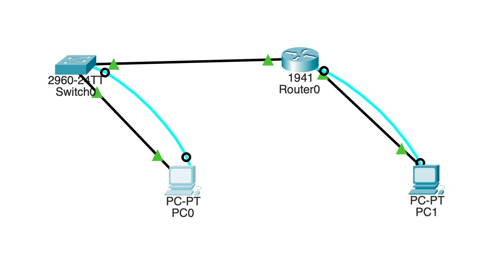

# Proyecto Integrador 4° Semestre Grupo B

## **Datos del Equipo**  
**Institución**: Instituto Tecnológico Superior del Occidente del Estado de Hidalgo.  
**Programa Educativo**: Ingeniería en Tecnologías de la Información y Comunicaciones.  
**Semestre y Grupo**: 4° "B".  
**Asignatura**: Fundamentos de Redes.  

**Integrantes**:    
- Abraham Calva (230110637)  
- Freyra Wendy Martinez Martinez (230110434)  
- Carol Mera Ibarra (230110264)
- Valeria Soto Hernandez (230110118)   
---
## **Problematica:**

La gestión de pedidos en la florería se realiza de manera manual o con métodos poco organizados, lo que genera dificultades en el control de los pedidos, retrasos en las entregas y posibles errores en la administración de clientes, productos y pagos. Esto impacta negativamente en la eficiencia operativa del negocio y en la satisfacción del cliente, ya que no se cuenta con un sistema que permita organizar y automatizar los procesos de forma eficiente.
---
## **Objetivo General**

Desarrollar un sistema informático que permita la gestión eficiente de la agenda de pedidos de una florería, clientes, productos y envíos a domicilio,  mediante una bases de datos, un lenguaje de programación; implementado en una red de comuputadora cliente servidor.

---

## **Alcance Técnico de la Topología**  
1. **Asignación de Direcciones IP:**

- Se utilizará un bloque IPv4 privado clase C (172.16.0.0/24), dividido en subredes para organizar de forma eficiente el direccionamiento.

2. **Soporte para IPv6:**

- Se integrará direccionamiento Global Unicast (2001:db8::/64) junto con Link-Local automático, permitiendo conectividad moderna y facilitando la futura migración completa a IPv6.

3. **Parámetros de Configuración:**

- Router: Se habilitará el enrutamiento IPv6, se establecerán contraseñas cifradas tipo Secret y se activará el acceso remoto vía SSH.

- Switch: Se configurará la interfaz VLAN1 con dirección IPv4, gateway predeterminado y una descripción administrativa.

---
## **Cálculo de  Subred en Equipo 4**  
**Dirección IP:** 172.16.0.0 /24  
**Máscara:** 255.255.255.0  
**Número de Subredes:** 8    
**Nueva máscara:** 255.255.255.224  =  /27   

<table>
    <tr>
        <td> <strong>172.16.0.</strong> </td>
        <td> <strong>128</strong> </td>
        <td> <strong>64</strong> </td>
        <td> <strong>32</strong> </td>
        <td> <strong>16</strong> </td>
        <td> <strong>8</strong> </td>
        <td> <strong>4</strong> </td>
        <td> <strong>2</strong> </td>
        <td> <strong>1</strong> </td>
        <td> 
            <strong>Network ID</strong>
            

            <strong>Broadcast</strong>
            </td>
            <td><strong>1er Dirección</strong>
            

            <strong>Ult. Dirección</strong>
        </td>
    </tr>
    <tr>
        <td rowspan="2" > <strong>Equipo 1</strong> </td>
        <td>0 </td>
        <td>0 </td>
        <td>0 </td>
        <td> </td>
        <td> </td>
        <td> </td>
        <td> </td>
        <td> </td>
        <td> </td>
        <td> </td>
    </tr>
    <tr>
        <td> 0 </td>
        <td> 0 </td>
        <td> 0 </td>
        <td> </td>
        <td> </td>
        <td> </td>
        <td> </td>
        <td> </td>
        <td> </td>
        <td> </td>
    </tr>
    <tr>
        <td rowspan="2" ><strong>Equipo 2</strong></td>
        <td>0</td>
        <td>0</td>
        <td>1</td>
        <td></td>
        <td></td>
        <td></td>
        <td></td>
        <td></td>
        <td></td>
        <td></td>
    </tr>
    <tr>
        <td>0</td>
        <td>0</td>
        <td>1</td>
        <td></td>
        <td></td>
        <td></td>
        <td></td>
        <td></td>
        <td></td>
        <td></td>
    </tr>
    <tr>
        <td rowspan="2" ><strong>Equipo 3</strong></td>
        <td>0</td>
        <td>1</td>
        <td>0</td>
        <td></td>
        <td></td>
        <td></td>
        <td></td>
        <td></td>
        <td></td>
        <td></td>
    </tr>
    <tr>
        <td>0</td>
        <td>1</td>
        <td>0</td>
        <td></td>
        <td></td>
        <td></td>
        <td></td>
        <td></td>
        <td></td>
        <td></td>
    </tr>
    <tr>
        <td rowspan="2" ><strong>Equipo 4</strong></td>
        <td>0</td>
        <td>1</td>
        <td>1</td>
        <td>0</td>
        <td>0</td>
        <td>0</td>
        <td>0</td>
        <td>0</td>
        <td>172.16.0.96</td>
        <td>172.16.0.97</td>
    </tr>
    <tr>
        <td>0</td>
        <td>1</td>
        <td>1</td>
        <td>1</td>
        <td>1</td>
        <td>1</td>
        <td>1</td>
        <td>1</td>
        <td>172.16.0.127</td>
        <td>172.16.0.126</td>
    </tr>
</table>

--- 

## **Direccionamiento de nuestra subred**
<table>
    <tr>
        <td colspan="5" ><strong>Switch SD</strong> </td>
    </tr>
    <tr>
        <td> <strong>Interface</strong> </td>
        <td> <strong>IPv4</strong> </td>
        <td> <strong>Máscara</strong> </td>
        <td> <strong>IPv6 Link-Local</strong> </td>
        <td> <strong>IPv6 Global (eui-64)</strong> </td>
    </tr>
    <tr>
        <td> VLAN 1 </td>
        <td> 172.16.0.97 </td>
        <td> 255.255.255.224 </td>
        <td> FE80::1 </td>
        <td> 2001:db8:1:d::/64</td>
    </tr>
</table>
<table>
    <tr>
        <td colspan="5" > <strong>Router RD</strong> </td>
    </tr>
    <tr>
        <td> <strong>Interface</strong> </td>
        <td> <strong>IPv4</strong> </td>
        <td> <strong>Máscara</strong> </td>
        <td> <strong>IPv6 Link-Local</strong> </td>
        <td> <strong>IPv6 Global (eui-64)</strong> </td>
    </tr>
    <tr>
        <td> GigabitEthernet 0/1 </td>
        <td> 172.16.0.98 </td>
        <td> 255.255.255.224 </td>
        <td> FE80::1 </td>
        <td> 2001:db8:1:d::/64 </td>
    </tr>
</table>

--- 

## **Topología**
    
La topología utilizada en este proyecto es la que se muestra en pantalla y que tambien puedes encontrar en: <a href="conexiones ipv4-ipv6.pkt">Conexiones ipv4-ipv6.pkt</a>  

---
## **Configuraciones de los equipos (Switch y Router)**
### **Switch RD**
1. **Configurar el nombre de host**

2. **Establecer el banner de bienvenida**

3. **Configurar las contraseñas:**

- Contraseña sin cifrar (Password)

- Contraseña cifrada (Secret)

- Contraseña de consola

- Encriptar todas las contraseñas

4. **Configurar el acceso remoto:**

- Telnet

- SSH

5. **Habilitar el soporte para IPv4 e IPv6**

6. **Configuración de la interfaz Vlan1:**

- Asignar dirección IPv4 y máscara de subred

- Asignar puerta de enlace predeterminada (default gateway)

- Asignar dirección Global IPv6

- Asignar dirección Link-Local IPv6

- Agregar una descripción a la interfaz

 
    

       Resumen de las configuraciones hechas en el Switch SD
    

Configurar modo dual
NOTA: Esto tiene que ser lo primero que se le hace a nuestro switch, ya que al reiniciarlo aceptamos que guarde los comandos ingreesados hasta el momento, en nuestro caso solo queremos que deje habilitado el modo dual de ipv4-ipv6
    <pre><code>
Switch>enable
Switch#configure terminal
Switch(config)#sdm prefer dual-ipv4-and-ipv6 default
Switch(config)#end
Switch#reload
Switch# (Aceptar los siguientes comandos dando enter, y escribiendotelos la palabra YES cuando la pide)
    </code></pre>

Configuraciones basicas:

Configurar nombre de host
    <pre><code>
Switch>enable
Switch>configure terminal
Switch(config)#hostname SD
    </code></pre>

Agregar mensaje de bienvenida al switch
    <pre><code>
SD>enable
SD#configure terminal
SD(config)#banner motd "Bienvenidos al Switch D"
    </code></pre>

Configurar Consola
    <pre><code>
SD(config)#line console 0
SD(config-line)#password console
SD(config-line)#login
SD(config-line)#exit
    </code></pre>
    
Configurar Telnet
    <pre><code>
SD(config)#line vty 0 15
SD(config-line)#password telnet
SD(config-line)#transport input telnet
SD(config-line)#login
SD(config-line)#exit
    </code></pre>

Configurar SSH
    <pre><code>
SD(config)#ip domain-name cisco.com
SD(config)#username admin password admin
SD(config)#crypto key generate rsa
How many bits in the modulus [512]: 1024
SD(config)#line vty 0 15
*Mar  1 0:07:27.932: SSH-5-ENABLED: SSH 1.99 has been enabled
SD(config-line)#transport input ssh
SD(config-line)#login local
SD(config-line)#exit
    </code></pre>

Configurar ipv4 y ipv6
    <pre><code>
SD>enable
SD#configure terminal
SD(config)#interface vlan 1
SD(config-if)#ip address 172.16.0.97 255.255.255.224
SD(config-if)#ipv6 address 2001:db8:2:d::/64 eui-64
SD(config-if)#ipv6 address FE80::1 link-local
SD(config-if)#no shutdown
SD(config-if)#
*LINK-5-CHANGED: Interface Vlan1, changed state to up
SD(config-if)#description "toAdmin"
SD(config-if)#exit
SD(config)#
    </code></pre>

### **Router RD**
1. **Configurar el nombre de host**

2. **Establecer el banner de bienvenida**

3. **Configurar las contraseñas:**

- Contraseña sin cifrar (Password)

- Contraseña cifrada (Secret)

- Contraseña de consola

- Encriptar todas las contraseñas

4. **Configurar el acceso remoto:**

- Telnet

- SSH

5. **Habilitar el enrutamiento IPv6**

6. **Configuración de la interfaz GigabitEthernet:**

- Asignar dirección IPv4 y máscara de subred

- Asignar dirección Global IPv6

- Asignar dirección Link-Local IPv6

- Agregar una descripción a la interfaz

 
    

        Resumen de las configuraciones hechas en el Router RD
    

Configuraciones basicas:
Configurar nombre de host
    <pre><code>
Router>enable
Router>configure terminal
Router(config)#hostname RD
    </code></pre>

Agregar mensaje de bienvenida al router
    <pre><code>
RD>enable
RD#configure terminal
RD(config)#banner motd "Bienvenidos al Router D"
    </code></pre>

Configurar Consola
    <pre><code>
RD(config)#line console 0
RD(config-line)#password console
RD(config-line)#login
RD(config-line)#exit
    </code></pre>

Configurar Telnet
    <pre><code>
RD(config)#line vty 0 15
RD(config-line)#password telnet
RD(config-line)#transport input telnet
RD(config-line)#login
RD(config-line)#exit
    </code></pre>

Configurar SSH
    <pre><code>
RD#configure terminal
RD(config)#ip domain-name cisco.com
RD(config)#username admin password admin
RD(config)#crypto key generate rsa
How many bits in the modulus [512]: 1024
RD(config)#line vty 0 15
*Mar  1 0:07:27.932: SSH-5-ENABLED: SSH 1.99 has been enabled
RD(config-line)#transport input ssh
RD(config-line)#login local
RD(config-line)#exit
RD(config)#
    </code></pre>

Configurar ipv4 y ipv6
    <pre><code>
RD>enable
RD#configure terminal
RD(config)#ipv6 unicast-routing
RD(config)#interface g0/1
RD(config-if)#ip address 172.16.0.98 255.255.255.224
RD(config-if)#ipv6 address 2001:db8:1:d::/64 eui-64
RD(config-if)#ipv6 address FE80::1 link-local
RD(config-if)#no shutdown

RD(config-if)#
*LINK-5-CHANGED: Interface GigabitEthernet0/1, changed state to up
RD(config-if)#description "toLanD"
RD(config-if)#exit
    </code></pre>

## **Verificación de Conectividad**

### **Ping IPv6**
<pre><code>
C:\>ping FE80::1

Pinging FE80::1 with 32 bytes of data:

Reply from FE80::1: bytes=32 time<1ms TTL=255
Reply from FE80::1: bytes=32 time<1ms TTL=255
Reply from FE80::1: bytes=32 time<1ms TTL=255
Reply from FE80::1: bytes=32 time<1ms TTL=255

Ping statistics for FE80::1:
    Packets: Sent = 4, Received = 4, Lost = 0 (0% loss),
    Approximate round trip times in milli-seconds:
        Minimum = 0ms, Maximum = 1ms, Average = 0ms
</code></pre>

### **Ping IPv4**
<pre><code>
C:\>ping 172.16.0.97

Pinging 172.16.0.97 with 32 bytes of data:

Reply from 172.16.0.97: bytes=32 time<1ms TTL=255
Reply from 172.16.0.97: bytes=32 time<1ms TTL=255
Reply from 172.16.0.97: bytes=32 time<1ms TTL=255
Reply from 172.16.0.97: bytes=32 time<1ms TTL=255

Ping statistics for 172.16.0.97:
    Packets: Sent = 4, Received = 4, Lost = 0 (0% loss),
    Approximate round trip times in milli-seconds:
        Minimum = 0ms, Maximum = 0ms, Average = 0ms
</code></pre>
